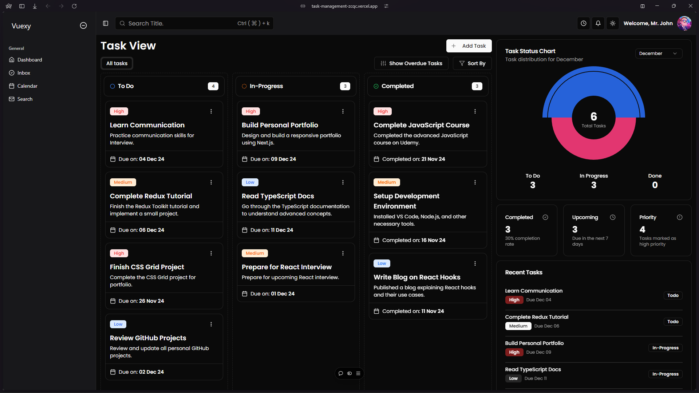
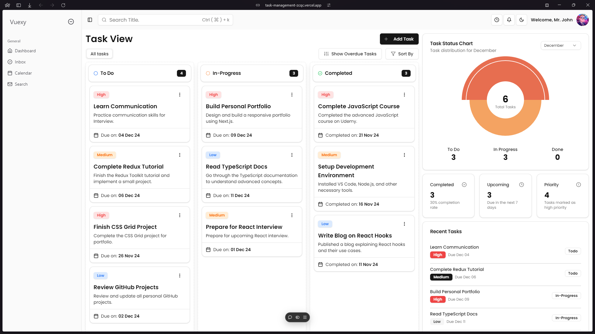

# Task-Management-Dashboard

https://task-management-zcqc.vercel.app/dashboard

A Task management UI dashboard.

## Features

1. **Task drag and drop**

   - Drag and drop task cards to change task progress.

2. **Filtering and Sorting**

   - Filter and Sort tasks according to due Date, Title, Priority.

   - Search for tasks using title

3. **Dashboard UI**

   - Responsive and beautiful UI including interactive tasks, animations and charts.

4. **Tasks action**

   - Create, Edit, Update, Delete your tasks seamlessly.

## Getting Started

### Prerequisites

Ensure you have the following installed:

- [Node.js](https://nodejs.org/) (version 18 or higher recommended)
- [pnpm](https://pnpm.io/)

### Installation

1. Clone the repository:

   ```bash
   git clone https://github.com/khalid-09/task-management.git

   ```

2. Navigate to the project directory:

   ```bash
   cd task-management

   ```

3. Install the dependencies:

   ```bash
   pnpm i
   ```

### Running the development server

```bash
  pnpm dev
```

### Screenshots



